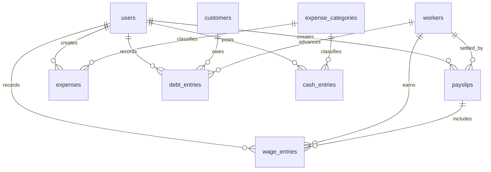

# Database Schema

> MySQL schema for shop operations: auth + công nợ + công thợ + sổ quỹ.
> Hibernate `ddl-auto=update` tạo/sửa bảng từ entity — file này là nguồn sự thật khi viết class.
> Domain rules: `docs/decisions/003-shop-ledger-payroll.md`

---

## 1. JPA / ddl-auto — bắt buộc khi viết entity

`application.properties` đang `spring.jpa.hibernate.ddl-auto=update`.

| Làm | Không làm |
|-----|-----------|
| `@Table(name = "snake_case")` + `@Index` | Để Hibernate đặt tên mặc định |
| `@Column(nullable, length, unique, precision, scale)` | Tin rằng MySQL sẽ “đoán” đúng |
| Tiền: `BigDecimal` + `precision = 15, scale = 2` | `double` / `float` |
| `@Enumerated(EnumType.STRING)` + `length` đủ chứa tên enum | `ORDINAL` |
| Ngày nghiệp vụ: `LocalDate` (`workDate`, `entryDate`) | `Instant` cho ngày công/ngày chi |
| Audit: `Instant createdAt` / `updatedAt` | `java.util.Date` |
| `@ManyToOne(fetch = LAZY)` + `@JoinColumn` | `EAGER` trên collection |
| Validate XOR / số dương trong **service** | Trông chờ CHECK constraint (ddl-auto không tạo) |

`update` **không** xóa cột/bảng thừa, **không** đổi kiểu an toàn (ví dụ VARCHAR → DECIMAL). Dev được; prod phải `validate` + migration sau này.

---

## 2. Hai lớp dữ liệu

```
Chứng từ (user thao tác)          Sổ (append-only, thống kê)
─────────────────────────         ──────────────────────────
customers, workers                debt_entries   → số dư công nợ
wage_entries                      cash_entries   → quỹ + báo cáo chi
payslips, expenses
expense_categories
```

Số dư **không** phải nguồn sự thật. Cache trên `customers.current_debt` / `workers.current_advance` chỉ cập nhật trong cùng transaction khi ghi sổ.

```
Nợ khách hiện tại     = Σ CHARGE − Σ PAYMENT ± ADJUST   (debt_entries, customer_id)
Ứng thợ chưa trừ      = Σ CHARGE − Σ PAYMENT ± ADJUST   (debt_entries, worker_id)
Công chưa trả         = Σ wage_entries.amount WHERE payslip_id IS NULL
Chi tiêu kỳ           = Σ cash_entries.amount WHERE direction = OUT AND entry_date IN range
Thu kỳ                = Σ cash_entries.amount WHERE direction = IN  AND entry_date IN range
```

---

## 3. Entity Relationship Diagram

```
 AUTH (giữ nguyên)
 users ── company_id → companies
 users ── N:M → roles ── N:M → permissions
 users ── 1:N → refresh_tokens

 NGHIỆP VỤ
 User 1 ── * WageEntry, Payslip, Expense, DebtEntry, CashEntry

 Customer 1 ── * DebtEntry
 Worker   1 ── * WageEntry
 Worker   1 ── * Payslip
 Worker   1 ── * DebtEntry          (ứng lương)

 ExpenseCategory 1 ── * Expense
 ExpenseCategory 1 ── * CashEntry

 Payslip  1 ── * WageEntry          (các dòng công được quyết toán)
 Expense  1 ── 0..1 CashEntry
 Payslip  1 ── 0..1 CashEntry       (khi PAID, netAmount)
```



Phase 2 (chưa tạo entity): `products`, `sales`, `sale_items`, `suppliers`, `purchases` — ghi nợ khách vòng 1 **không cần** hóa đơn; chỉ `debt_entries`.

---

## 4. Auth tables

`User` = người **đăng nhập** (chủ quán / nhân viên ghi sổ). Không dùng `User` làm công nhân.

### users

| Column | Type | Constraints | Description |
|--------|------|-------------|-------------|
| id | BIGINT | PK, AUTO_INCREMENT | |
| name | VARCHAR(100) | NOT NULL | Full name |
| email | VARCHAR(255) | NOT NULL, UNIQUE | Login email |
| password | VARCHAR(255) | NOT NULL | BCrypt hash |
| age | INT | NULLABLE | |
| address | VARCHAR(255) | NULLABLE | |
| gender | VARCHAR(20) | NULLABLE | Enum: MALE, FEMALE, OTHER |
| avatar | VARCHAR(255) | NULLABLE | Avatar image path/URL |
| is_active | BOOLEAN | NOT NULL, default true | Soft disable — không xóa cứng |
| company_id | BIGINT | FK → companies(id), NULLABLE | |
| created_at | TIMESTAMP | NOT NULL | |
| updated_at | TIMESTAMP | NULLABLE | |

Indexes: `UNIQUE idx_users_email (email)`, `INDEX idx_users_company (company_id)`, `INDEX idx_users_active (is_active)`

**Xóa:** `DELETE /users/{id}` chỉ set `is_active = false` + revoke refresh tokens (không xóa row). Kích hoạt: `POST /users/{id}/enable`.

### companies

| Column | Type | Constraints | Description |
|--------|------|-------------|-------------|
| id | BIGINT | PK | |
| name | VARCHAR(255) | NOT NULL | |
| description | TEXT | NULLABLE | |
| address | VARCHAR(255) | NULLABLE | |
| logo | VARCHAR(255) | NULLABLE | |
| is_active | BOOLEAN | NOT NULL, default true | Soft disable — không xóa cứng |
| created_at / updated_at | TIMESTAMP | | |

Index: `idx_companies_active (is_active)`

**Xóa:** `DELETE /companies/{id}` chỉ set `is_active = false` (không xóa row, không null `users.company_id`). Kích hoạt lại: `POST /companies/{id}/enable`.

### roles

| Column | Type | Constraints | Description |
|--------|------|-------------|-------------|
| id | BIGINT | PK | |
| name | VARCHAR(100) | NOT NULL, UNIQUE | ADMIN, MANAGER, USER, … |
| description | VARCHAR(255) | NULLABLE | |
| created_at / updated_at | TIMESTAMP | | |

### permissions

| Column | Type | Constraints | Description |
|--------|------|-------------|-------------|
| id | BIGINT | PK | |
| name | VARCHAR(100) | NOT NULL | |
| api_path | VARCHAR(255) | NOT NULL | e.g. /api/v1/users |
| method | VARCHAR(10) | NOT NULL | GET, POST, PUT, DELETE |
| module | VARCHAR(100) | NOT NULL | USER, WAGE, CASHBOOK, … |
| created_at / updated_at | TIMESTAMP | | |

Index: `UNIQUE idx_permissions_path_method (api_path, method)`

### user_role / permission_role

Composite PK, ON DELETE CASCADE. Owner JPA: User `@JoinTable user_role`, Role `@JoinTable permission_role`.

### refresh_tokens

| Column | Type | Constraints | Description |
|--------|------|-------------|-------------|
| id | BIGINT | PK | |
| token | VARCHAR(512) | NOT NULL, UNIQUE | SHA-256 hash of JWT |
| user_id | BIGINT | FK users, NOT NULL | |
| expires_at | TIMESTAMP | NOT NULL | |
| revoked | BOOLEAN | NOT NULL, default false | |
| device_info | VARCHAR(255) | NULLABLE | |
| ip_address | VARCHAR(45) | NULLABLE | |
| created_at | TIMESTAMP | NOT NULL | |

Xóa User: revoke token, không cascade delete. Chi tiết: ADR-001.

---

## 5. Business tables

Tiền mặt định dạng chung:

```java
@Column(nullable = false, precision = 15, scale = 2)
private BigDecimal amount;   // luôn > 0; chiều nằm ở enum direction / entryType
```

### expense_categories
8938565145015

Loại thu/chi. Seed cố định cho báo cáo lương / ứng / thu nợ.

| Column | Type | Constraints | Description |
|--------|------|-------------|-------------|
| id | BIGINT | PK, IDENTITY | |
| code | VARCHAR(50) | NOT NULL, UNIQUE | `WAGE`, `WORKER_ADVANCE`, `CUSTOMER_REPAY`, `UTILITIES`, `RENT`, `GOODS`, `OTHER`, `MANUAL_IN` |
| name | VARCHAR(100) | NOT NULL | Tên hiển thị |
| is_system | BOOLEAN | NOT NULL, default false | true = không xóa (code nghiệp vụ) |
| sort_order | INT | NOT NULL, default 0 | |
| created_at | TIMESTAMP | NOT NULL | |
| updated_at | TIMESTAMP | NULLABLE | |

```java
@Entity
@Table(name = "expense_categories")
public class ExpenseCategory { /* code unique, isSystem */ }
```

Seed `is_system = true`: `WAGE`, `WORKER_ADVANCE`, `CUSTOMER_REPAY`.

---

### customers

| Column | Type | Constraints | Description |
|--------|------|-------------|-------------|
| id | BIGINT | PK | |
| name | VARCHAR(100) | NOT NULL | |
| phone | VARCHAR(20) | UNIQUE, NULLABLE | Tìm nhanh; unique khi không null |
| address | VARCHAR(255) | NULLABLE | |
| note | VARCHAR(500) | NULLABLE | |
| is_active | BOOLEAN | NOT NULL, default true | |
| current_debt | DECIMAL(15,2) | NOT NULL, default 0 | Cache; cập nhật cùng DebtEntry |
| created_at / updated_at | TIMESTAMP | | |

Indexes: `UNIQUE idx_customers_phone (phone)`

**Xóa:** soft disable (`is_active = false`). Kích hoạt: `POST /customers/{id}/enable`. Không sửa `current_debt` từ CRUD.

---

### workers

Công nhân / thợ — **không** có password, **không** FK bắt buộc tới `users`.

| Column | Type | Constraints | Description |
|--------|------|-------------|-------------|
| id | BIGINT | PK | |
| name | VARCHAR(100) | NOT NULL | |
| phone | VARCHAR(20) | UNIQUE, NULLABLE | |
| address | VARCHAR(255) | NULLABLE | |
| job_title | VARCHAR(100) | NULLABLE | vd. thợ hồ, phụ kho |
| wage_type | VARCHAR(20) | NOT NULL | Enum: `DAILY`, `HOURLY`, `PIECE` |
| default_unit_rate | DECIMAL(15,2) | NOT NULL | Đơn giá mặc định khi ghi công |
| hire_date | DATE | NULLABLE | |
| is_active | BOOLEAN | NOT NULL, default true | Nghỉ việc: false, giữ lịch sử |
| note | VARCHAR(500) | NULLABLE | |
| current_advance | DECIMAL(15,2) | NOT NULL, default 0 | Cache ứng chưa trừ lương |
| created_at / updated_at | TIMESTAMP | | |

```java
@Enumerated(EnumType.STRING)
@Column(nullable = false, length = 20)
private WageType wageType;
```

---

### wage_entries — ghi công

Một ngày có thể nhiều dòng (công nhật + khoán). **Không** ghi sổ quỹ.

| Column | Type | Constraints | Description |
|--------|------|-------------|-------------|
| id | BIGINT | PK | |
| worker_id | BIGINT | FK workers, NOT NULL | |
| work_date | DATE | NOT NULL | Ngày làm |
| wage_type | VARCHAR(20) | NOT NULL | Snapshot; có thể khác default của thợ |
| quantity | DECIMAL(12,3) | NOT NULL | Số ngày / giờ / sản phẩm |
| unit_rate | DECIMAL(15,2) | NOT NULL | Đơn giá lúc ghi |
| amount | DECIMAL(15,2) | NOT NULL | `quantity * unit_rate` (lưu snapshot) |
| note | VARCHAR(500) | NULLABLE | |
| payslip_id | BIGINT | FK payslips, NULLABLE | null = chưa quyết toán |
| created_by | BIGINT | FK users, NOT NULL | |
| created_at / updated_at | TIMESTAMP | | |

Indexes:
- `idx_wage_entries_worker_date (worker_id, work_date)`
- `idx_wage_entries_payslip (payslip_id)`

```java
@ManyToOne(fetch = FetchType.LAZY)
@JoinColumn(name = "worker_id", nullable = false)
private Worker worker;

@ManyToOne(fetch = FetchType.LAZY)
@JoinColumn(name = "payslip_id")
private Payslip payslip;          // null = chưa gộp vào phiếu lương

@ManyToOne(fetch = FetchType.LAZY)
@JoinColumn(name = "created_by", nullable = false)
private User createdBy;
```

Service: không sửa `amount` tự do — luôn `quantity × unit_rate`. Không gán `payslip_id` nếu phiếu đã `PAID`.

---

### payslips — trả lương

| Column | Type | Constraints | Description |
|--------|------|-------------|-------------|
| id | BIGINT | PK | |
| worker_id | BIGINT | FK workers, NOT NULL | |
| period_start | DATE | NOT NULL | |
| period_end | DATE | NOT NULL | |
| gross_amount | DECIMAL(15,2) | NOT NULL | Tổng công trong kỳ |
| advance_deducted | DECIMAL(15,2) | NOT NULL, default 0 | Trừ ứng |
| other_deduction | DECIMAL(15,2) | NOT NULL, default 0 | Phạt / trừ khác |
| net_amount | DECIMAL(15,2) | NOT NULL | `gross − advance − other` (≥ 0) |
| status | VARCHAR(20) | NOT NULL | `DRAFT`, `CONFIRMED`, `PAID`, `CANCELLED` |
| paid_at | TIMESTAMP | NULLABLE | Khi chuyển PAID |
| note | VARCHAR(500) | NULLABLE | |
| created_by | BIGINT | FK users, NOT NULL | |
| created_at / updated_at | TIMESTAMP | | |

Indexes: `idx_payslips_worker_period (worker_id, period_start, period_end)`

Luồng service (một `@Transactional`):

1. `DRAFT`: chọn thợ + khoảng ngày → cộng `wage_entries` chưa có `payslip_id` → gán `payslip_id`.
2. `advance_deducted` ≤ `worker.current_advance`.
3. `PAID`: insert `cash_entries` OUT category `WAGE` amount = `net_amount`; insert `debt_entries` PAYMENT (worker) amount = `advance_deducted` (nếu > 0); set `paid_at`.
4. `CANCELLED` (chỉ khi chưa PAID): gỡ `wage_entries.payslip_id = null`. Đã PAID thì đảo bút sổ quỹ + sổ nợ, không xóa row.

---

### debt_entries — ghi nợ / trả nợ / ứng lương

Một bảng, hai FK nullable (Hibernate không sinh XOR — service bắt đúng 1 trong 2).

| Column | Type | Constraints | Description |
|--------|------|-------------|-------------|
| id | BIGINT | PK | |
| customer_id | BIGINT | FK customers, NULLABLE | Nợ khách |
| worker_id | BIGINT | FK workers, NULLABLE | Ứng / trừ ứng thợ |
| entry_type | VARCHAR(20) | NOT NULL | `CHARGE` tăng, `PAYMENT` giảm, `ADJUST` |
| amount | DECIMAL(15,2) | NOT NULL | > 0 |
| entry_date | DATE | NOT NULL | |
| note | VARCHAR(500) | NULLABLE | |
| ref_type | VARCHAR(30) | NULLABLE | `PAYSLIP`, `EXPENSE`, `MANUAL` |
| ref_id | BIGINT | NULLABLE | |
| created_by | BIGINT | FK users, NOT NULL | |
| created_at | TIMESTAMP | NOT NULL | Không `updated_at` — không sửa dòng sổ |

Indexes:
- `idx_debt_customer_date (customer_id, entry_date)`
- `idx_debt_worker_date (worker_id, entry_date)`

```java
@ManyToOne(fetch = FetchType.LAZY)
@JoinColumn(name = "customer_id")
private Customer customer;

@ManyToOne(fetch = FetchType.LAZY)
@JoinColumn(name = "worker_id")
private Worker worker;
```

| Tình huống | customer | worker | type | CashEntry? |
|------------|----------|--------|------|------------|
| Khách ghi nợ | ✓ | | CHARGE | Không |
| Khách trả nợ | ✓ | | PAYMENT | IN, category `CUSTOMER_REPAY` |
| Thợ ứng lương | | ✓ | CHARGE | OUT, category `WORKER_ADVANCE` |
| Trừ ứng khi trả lương | | ✓ | PAYMENT | Không (tiền nằm ở phiếu lương) |
| Điều chỉnh sai số | 1 bên | | ADJUST | Chỉ khi có tiền mặt thật |

`ADJUST`: quy ước `note` bắt đầu `+/−` và service cộng/trừ cache đúng dấu; hoặc thêm enum `direction` `INCREASE`/`DECREASE` nếu muốn rõ hơn lúc code (khuyến nghị thêm `direction` VARCHAR(20) NOT NULL).

**Khuyến nghị entity:** thêm `direction` (`INCREASE` / `DECREASE`) để không nhúng dấu trong note.

| entry_type | direction |
|------------|-----------|
| CHARGE | INCREASE |
| PAYMENT | DECREASE |
| ADJUST | INCREASE hoặc DECREASE |

---

### expenses — phiếu chi cửa hàng

Chi điện, thuê nhà, mua vật tư… **Không** dùng bảng này cho lương (lương đi qua `payslips`).

| Column | Type | Constraints | Description |
|--------|------|-------------|-------------|
| id | BIGINT | PK | |
| category_id | BIGINT | FK expense_categories, NOT NULL | Không dùng code system `WAGE` |
| amount | DECIMAL(15,2) | NOT NULL | |
| expense_date | DATE | NOT NULL | |
| note | VARCHAR(500) | NULLABLE | |
| status | VARCHAR(20) | NOT NULL | `POSTED`, `CANCELLED` |
| created_by | BIGINT | FK users, NOT NULL | |
| created_at / updated_at | TIMESTAMP | | |

POSTED → 1 `cash_entries` OUT cùng `category_id`, `ref_type = EXPENSE`.

---

### cash_entries — sổ quỹ (thống kê chi tiêu)

Chỉ service nghiệp vụ insert (PAYSLIP, EXPENSE, …). UI sổ quỹ chỉ **tạo MANUAL** + cập nhật note/checked. Chi tiết: `docs/features/cashbook-requirements.md`.

| Column | Type | Constraints | Description |
|--------|------|-------------|-------------|
| id | BIGINT | PK | |
| entry_date | DATE | NOT NULL | Ngày nghiệp vụ (theo VN khi tạo từ UI) |
| direction | VARCHAR(10) | NOT NULL | `IN`, `OUT` |
| amount | DECIMAL(15,2) | NOT NULL | > 0 |
| category_id | BIGINT | FK expense_categories, NOT NULL | Trục thống kê |
| description | VARCHAR(500) | NULLABLE | Mô tả chứng từ |
| note | VARCHAR(500) | NULLABLE | Ghi chú thủ công (UI) |
| checked | BOOLEAN | NOT NULL, default false | Đã đối chiếu |
| checked_at | TIMESTAMP | NULLABLE | Thời điểm tick |
| checked_by | BIGINT | FK users, NULLABLE | Ai tick |
| ref_type | VARCHAR(30) | NOT NULL | `EXPENSE`, `PAYSLIP`, `WORKER_ADVANCE`, `CUSTOMER_PAYMENT`, `MANUAL` |
| ref_id | BIGINT | NULLABLE | id chứng từ; MANUAL có thể null |
| created_by | BIGINT | FK users, NOT NULL | |
| created_at | TIMESTAMP | NOT NULL | Append-only create |
| updated_at | TIMESTAMP | NULLABLE | Khi sửa note/checked |

Indexes:
- `idx_cash_date (entry_date)`
- `idx_cash_category_date (category_id, entry_date)`
- `idx_cash_ref (ref_type, ref_id)`
- `idx_cash_checked (checked)`

```java
@Entity
@Table(
    name = "cash_entries",
    indexes = {
        @Index(name = "idx_cash_date", columnList = "entry_date"),
        @Index(name = "idx_cash_category_date", columnList = "category_id, entry_date"),
        @Index(name = "idx_cash_ref", columnList = "ref_type, ref_id"),
        @Index(name = "idx_cash_checked", columnList = "checked")
    }
)
public class CashEntry { /* ... */ }
```

Không `@OneToMany` từ Customer/Worker tới sổ — query repository theo id.

---

## 6. Relationships summary (JPA)

| Relationship | Type | Owner | Join |
|-------------|------|-------|------|
| WageEntry → Worker | ManyToOne | WageEntry | `worker_id` |
| WageEntry → Payslip | ManyToOne | WageEntry | `payslip_id` |
| WageEntry → User | ManyToOne | WageEntry | `created_by` |
| Payslip → Worker | ManyToOne | Payslip | `worker_id` |
| DebtEntry → Customer | ManyToOne | DebtEntry | `customer_id` nullable |
| DebtEntry → Worker | ManyToOne | DebtEntry | `worker_id` nullable |
| Expense → ExpenseCategory | ManyToOne | Expense | `category_id` |
| CashEntry → ExpenseCategory | ManyToOne | CashEntry | `category_id` |
| * → User (createdBy) | ManyToOne | phía chứng từ | `created_by` |

Cascade:
- **Không** `CascadeType.ALL` từ Worker → wage/payslip/debt (xóa thợ không xóa lịch sử).
- Nghỉ việc: `worker.isActive = false`.
- Inverse `@OneToMany(mappedBy)` + `@JsonIgnore` nếu cần; list màn hình dùng query phân trang, không load collection.

---

## 7. Thống kê chi tiêu (đọc `cash_entries`)

Không cộng từ `expenses` + `payslips` — tránh double-count.

```sql
-- Chi theo loại trong khoảng ngày
SELECT c.id, c.name, SUM(e.amount) AS total
FROM cash_entries e
JOIN expense_categories c ON c.id = e.category_id
WHERE e.direction = 'OUT'
  AND e.entry_date BETWEEN :from AND :to
GROUP BY c.id, c.name
ORDER BY total DESC;

-- Quỹ trong kỳ
SELECT
  SUM(CASE WHEN direction = 'IN'  THEN amount ELSE 0 END) AS total_in,
  SUM(CASE WHEN direction = 'OUT' THEN amount ELSE 0 END) AS total_out
FROM cash_entries
WHERE entry_date BETWEEN :from AND :to;
```

Repository gợi ý:

```java
@Query("""
    select e.category.id, e.category.name, sum(e.amount)
    from CashEntry e
    where e.direction = Manager_vnd.Manager.feature.cashbook.CashDirection.OUT
      and e.entryDate between :from and :to
    group by e.category.id, e.category.name
    """)
List<Object[]> sumOutByCategory(LocalDate from, LocalDate to);
```

(Dùng enum FQCN hoặc so sánh parameter `:direction` cho gọn.)

Báo cáo công thợ (không phải chi tiền):

```sql
SELECT worker_id, SUM(amount) FROM wage_entries
WHERE work_date BETWEEN :from AND :to
GROUP BY worker_id;

SELECT worker_id, SUM(amount) FROM wage_entries
WHERE payslip_id IS NULL
GROUP BY worker_id;   -- công chưa trả
```

---

## 8. Enums (Java)

```java
public enum WageType { DAILY, HOURLY, PIECE }
public enum PayslipStatus { DRAFT, CONFIRMED, PAID, CANCELLED }
public enum DebtEntryType { CHARGE, PAYMENT, ADJUST }
public enum LedgerDirection { INCREASE, DECREASE }  // debt
public enum CashDirection { IN, OUT }
public enum CashRefType { EXPENSE, PAYSLIP, WORKER_ADVANCE, CUSTOMER_PAYMENT, MANUAL }
public enum ExpenseStatus { POSTED, CANCELLED }
```

Cột VARCHAR length ≥ tên hằng dài nhất (`WORKER_ADVANCE` = 15, `CUSTOMER_PAYMENT` = 17 → dùng 30 cho `ref_type`).

---

## 9. Skeleton entity (copy khi implement)

```java
@Entity
@Table(
    name = "workers",
    indexes = @Index(name = "idx_workers_phone", columnList = "phone", unique = true)
)
public class Worker {

    @Id
    @GeneratedValue(strategy = GenerationType.IDENTITY)
    private long id;

    @Column(nullable = false, length = 100)
    private String name;

    @Column(length = 20, unique = true)
    private String phone;

    @Enumerated(EnumType.STRING)
    @Column(name = "wage_type", nullable = false, length = 20)
    private WageType wageType;

    @Column(name = "default_unit_rate", nullable = false, precision = 15, scale = 2)
    private BigDecimal defaultUnitRate;

    @Column(name = "is_active", nullable = false)
    private boolean isActive = true;

    @Column(name = "current_advance", nullable = false, precision = 15, scale = 2)
    private BigDecimal currentAdvance = BigDecimal.ZERO;

    @CreationTimestamp
    private Instant createdAt;

    @UpdateTimestamp
    private Instant updatedAt;

    public Worker() {}
    // getters/setters — không @Data
}
```

MySQL unique trên `phone` NULL: nhiều NULL vẫn được. Chuẩn hóa SĐT trước khi save.

---

## 10. Thứ tự implement entity (để Hibernate tạo bảng đúng FK)

1. Auth: Permission → Company → Role → User → RefreshToken  
2. `ExpenseCategory` (không FK nghiệp vụ)  
3. `Customer`, `Worker`  
4. `DebtEntry`, `Expense`, `CashEntry`  
5. `Payslip` rồi `WageEntry` (vì `wage_entries.payslip_id`)  
   - Hoặc tạo `WageEntry` trước **không** `payslip_id`, thêm field ở bước sau — `update` chấp nhận thêm cột FK.

Package: `feature/{customer,worker,expense,debt,wage,payslip,cashbook}/`

---

## 11. Sample seed — expense_categories

| code | name | is_system |
|------|------|-----------|
| WAGE | Trả lương thợ | true |
| WORKER_ADVANCE | Ứng lương | true |
| CUSTOMER_REPAY | Thu nợ khách | true |
| UTILITIES | Điện nước | false |
| RENT | Thuê mặt bằng | false |
| GOODS | Mua hàng / vật tư | false |
| OTHER | Chi khác | false |
| MANUAL_IN | Thu khác | false |

---

## 12. Ví dụ số liệu

Thợ Nam: công nhật 300k. 2 ngày công; ứng 100k; trả lương tuần.

| Bảng | Dòng |
|------|------|
| wage_entries | 01/09 qty=1 rate=300000 amount=300000 |
| wage_entries | 02/09 qty=1 rate=300000 amount=300000 |
| debt_entries | CHARGE worker Nam 100000 + cash OUT 100000 category WORKER_ADVANCE |
| payslips | gross=600000, advance=100000, net=500000, PAID |
| cash_entries | OUT 500000 category WAGE ref PAYSLIP |
| debt_entries | PAYMENT worker 100000 ref PAYSLIP |

Thống kê chi tuần: 100k ứng + 500k lương = **600k OUT** (đúng tiền đã đưa thợ). Không cộng thêm `gross` 600k.

Khách Lan ghi nợ 50k rồi trả 50k: 1 CHARGE (không quỹ) + 1 PAYMENT + 1 cash IN `CUSTOMER_REPAY`.

---

## 13. Migration notes

- **Auth: 7 bảng.** **Nghiệp vụ: 8 bảng** — `expense_categories`, `customers`, `workers`, `wage_entries`, `payslips`, `debt_entries`, `expenses`, `cash_entries`.
- Dev: `ddl-auto=update`. Prod (sau này): `validate` + Flyway — chưa setup.
- Phase 2: `products` / `sales` / `sale_items` — bán chịu sẽ tạo `DebtEntry` CHARGE + optional `CashEntry` IN phần trả ngay.
- Gender / enum nghiệp vụ: luôn `STRING`.
- Sổ `cash_entries` / `debt_entries`: không UPDATE số tiền; hủy = dòng đảo hoặc `CANCELLED` trên chứng từ gốc.
